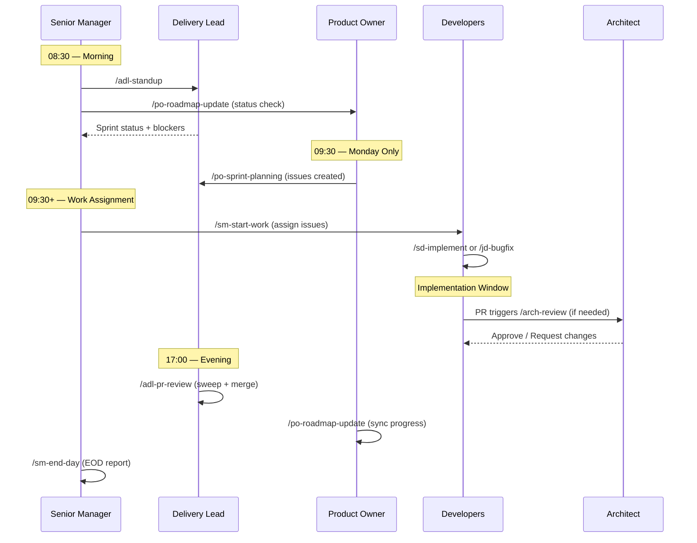

# Daily Workflow Iteration Playbook

> The complete operating rhythm for the Vindicta Agent Team, from morning check-in to evening close-out.

---

## Schedule

```
08:30  /sm-check-in         SM orchestrates morning (calls ADL + PO)
09:00  /adl-standup          ADL captures sprint status, flags blockers
09:30  /po-sprint-planning   PO creates weekly issues (Monday only)
       /sm-start-work        SM assigns work to developers
       ─── Implementation Window ───
       /sd-implement         Senior Dev builds features (TDD)
       /jd-bugfix            Junior Dev fixes bugs
       /arch-review          Architect reviews significant changes
       /sse-code-review      SSE reviews PRs with mentoring
17:00  /adl-pr-review        ADL sweeps and merges PRs
17:30  /po-roadmap-update    PO syncs ROADMAP.md with closed issues
18:00  /sm-end-day           SM generates EOD report, tomorrow's focus
Fri    /adl-weekly-report    ADL generates velocity report
```

---

## Swimlane Diagram



---

## Phase Details

### 1. Morning Check-In (08:30)

**Owner**: Senior Manager via `/sm-check-in`

- Orchestrates `/adl-standup` and `/po-roadmap-update`
- Runs org-wide health check (open issues, PR merge rates, stale items)
- Aggregates blockers from sub-agents
- Generates Platform Status Report

**Hands off to**: ADL (standup) and PO (roadmap)

### 2. Sprint Standup (09:00)

**Owner**: Delivery Lead via `/adl-standup`

- Reviews current week in 6-week roadmap
- Searches `status:in-progress` issues
- Flags items older than 4h as blocked
- Reports: completed yesterday, focus today, blockers

**Hands off to**: SM for work assignment

### 3. Sprint Planning — Monday Only (09:30)

**Owner**: Product Owner via `/po-sprint-planning`

- Identifies current week in roadmap schedule
- Creates GitHub issues with `P1-high` labels
- Adds issues to Project #4 (Platform Roadmap)
- Communicates sprint goal to Delivery Lead

**Hands off to**: ADL for execution

### 4. Work Assignment (09:30+)

**Owner**: Senior Manager via `/sm-start-work`

- Maps issues to agents by complexity:
  - **Junior Developer**: Low complexity (bugs, CSS)
  - **Senior Developer**: Medium complexity (core logic, BDD)
  - **Senior SW Engineer**: High complexity (architecture, security)
- Posts "🚀 Work Started" comment with ETA
- Invokes `/sd-implement` or `/jd-bugfix`

**Hands off to**: Developers

### 5. Implementation Window

**Owner**: Developers via `/sd-implement` or `/jd-bugfix`

- Follow Red-Green-Refactor cycle per Constitution Principle XI
- Create feature branch: `feature/{issue-number}-{short-description}`
- Create PR linked to issue on completion
- Tag SSE for review

**Hands off to**: SSE (code review) → Architect (if significant)

### 6. Evening PR Sweep (17:00)

**Owner**: Delivery Lead via `/adl-pr-review`

- Searches all open PRs across organization
- Checks Constitution compliance and CI status
- Requests Copilot review for foundation PRs or >5 files
- Squash-merges ready PRs and updates Project cards

**Hands off to**: PO (roadmap update)

### 7. Roadmap Sync (17:30)

**Owner**: Product Owner via `/po-roadmap-update`

- Searches issues closed today across organization
- Updates `ROADMAP.md` markers: `[ ]` → `[x]` or `[/]`
- Commits with message `docs: Update ROADMAP.md with current progress`

**Hands off to**: SM (end-of-day)

### 8. End of Day (18:00)

**Owner**: Senior Manager via `/sm-end-day`

- Invokes `/adl-pr-review` for final merge statistics
- Calculates daily progress vs. sprint average
- On Fridays, triggers `/adl-weekly-report` for velocity metrics
- Generates EOD report and tomorrow's focus

---

## Ad-Hoc Workflows

These run outside the daily cadence, triggered as needed:

| Workflow | When |
|:---|:---|
| `/arch-review` | Significant PR or spec requires architecture review |
| `/review-prs` | Cross-repo PR sweep outside daily cadence |
| `/po-release-management` | Milestone complete, ready for release |
| `/idle-discovery` | Agent has no assigned work, proactively finds tasks |
| `/speckit-*` lifecycle | Feature development outside sprint cadence |

---

## Escalation Quick Reference

| Issue | First Response | Escalation |
|:---|:---|:---|
| Implementation question | Senior Dev | SSE → Architect |
| Code review dispute | SSE | Architect |
| Blocked issue (>24h) | Delivery Lead | Product Owner |
| Sprint at risk | Delivery Lead | PO for scope change |
| Constitution violation | Any agent | Human immediately |
