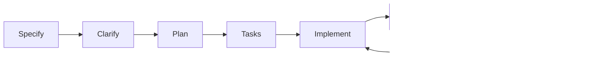

# Spec-Driven Development Lifecycle

The SDD lifecycle ensures features are fully specified before implementation begins.

## The Lifecycle

```
specify → clarify → plan → tasks → implement → verify
```



---

## Stage 1: Specify

**Goal**: Define WHAT and WHY (technology-agnostic)

**Owner**: Product Owner / Agile Delivery Lead

**Output**: `spec.md`

**Key Activities**:
- Define user stories with priority (P1-P3)
- Write acceptance criteria (Given/When/Then)
- List functional requirements
- Identify dependencies

**Quality Gate**: Each user story must be independently testable.

---

## Stage 2: Clarify

**Goal**: Eliminate ambiguity and edge cases

**Owner**: Architect / Tech Lead

**Process**: Three mandatory clarification cycles:
1. **Ambiguity Detection** — Find unclear terms
2. **Component Impact** — Identify affected files
3. **Failure Mode Analysis** — Define error handling

**Output**: Updated `spec.md` with resolved questions

---

## Stage 3: Plan

**Goal**: Define HOW (technical implementation)

**Owner**: Architect

**Output**: `plan.md`

**Key Activities**:
- Select technology stack
- Design component architecture
- Map file changes (new/modified/deleted)
- Check constitution compliance
- Assess risks

**Quality Gate**: All 12 constitution principles verified.

---

## Stage 4: Tasks

**Goal**: Define WHEN and WHERE (execution order)

**Owner**: Product Owner

**Output**: `tasks.md`

**Key Activities**:
- Break plan into atomic tasks
- Apply MODELS → SERVICES → ENDPOINTS ordering
- Mark parallelizable tasks `[P]`
- Map tasks to user stories `[USX]`

**Quality Gate**: Dependencies form a DAG (no cycles).

---

## Stage 5: Implement

**Goal**: Build the feature

**Owner**: Developer / AI Agent

**Key Activities**:
- Execute tasks in order
- Follow Red-Green-Refactor cycle
- Commit after each task
- Update task status

**Rules**:
- Tests MUST fail before implementation
- One commit per task
- Max 1,000 lines per PR

---

## Stage 6: Verify

**Goal**: Confirm quality and compliance

**Owner**: QA / Reviewer

**Output**: `checklist.md` (all items ✅)

**Key Activities**:
- Run all acceptance scenarios
- Verify constitution compliance
- Check quality gates (coverage, types, lint)
- Capture verification artifacts (screenshots)

**Quality Gate**: All checklist items pass.

---

## Workflow Commands

| Stage     | Slash Command        |
| --------- | -------------------- |
| Specify   | `/speckit-spec`      |
| Clarify   | `/speckit-clarify`   |
| Plan      | `/speckit-plan`      |
| Tasks     | `/speckit-tasks`     |
| Implement | `/speckit-implement` |
| Verify    | `/speckit-checklist` |

---

## File Structure

```
.specify/specs/{{NNN}}-{{feature-name}}/
├── spec.md       # Stage 1-2
├── plan.md       # Stage 3
├── tasks.md      # Stage 4
└── checklist.md  # Stage 6
```
