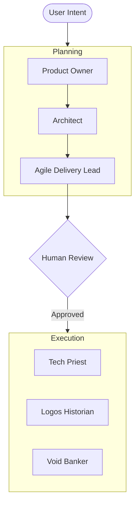
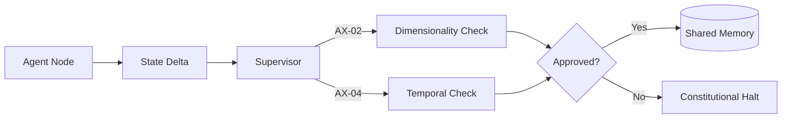

# Architecture Documentation & Review Tasks

## Objectives
- Standardize architecture diagrams across meso-repos.
- Integrate Axiomatic validation into all agentic workflows.
- Document the transition to a Split-Orchestrator model.

## Task List

### Phase 1: Documentation Cleanup
- [ ] **Task 01**: Update README.md with the current LangGraph swarm diagram.
- [ ] **Task 02**: Create `docs/architecture/swarm_v1.md` detailing the Planning/Execution lifecycle.
- [ ] **Task 03**: Verify all Mermaid diagrams are compatible with GitHub rendering.

### Phase 2: Orchestrator Split (Nexus-Agents)
- [ ] **Task 04**: Spike: Design JSON-RPC protocol for LangGraph-to-Nexus communication.
- [ ] **Task 05**: Implement the `Lease` management logic in `ResourceGovernor`.
- [ ] **Task 06**: Move `AxiomaticSupervisor` and `FlightRecorder` to a standalone `nexus-service`.

### Phase 3: Axiom Integration
- [ ] **Task 07**: Refactor `meta_graph` to validate Plan outputs against the Postulates.
- [ ] **Task 08**: Implement hard-interrupt for Constitutional Violations (AX-02, AX-04).

## Diagrams

### 1. Hierarchical Swarm

### 2. Axiomatic Supervisor Flow

